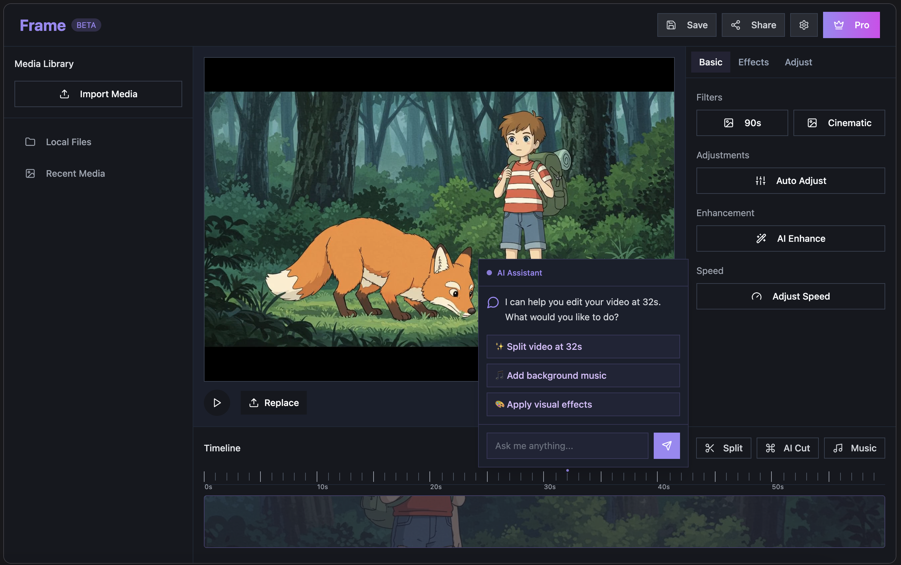
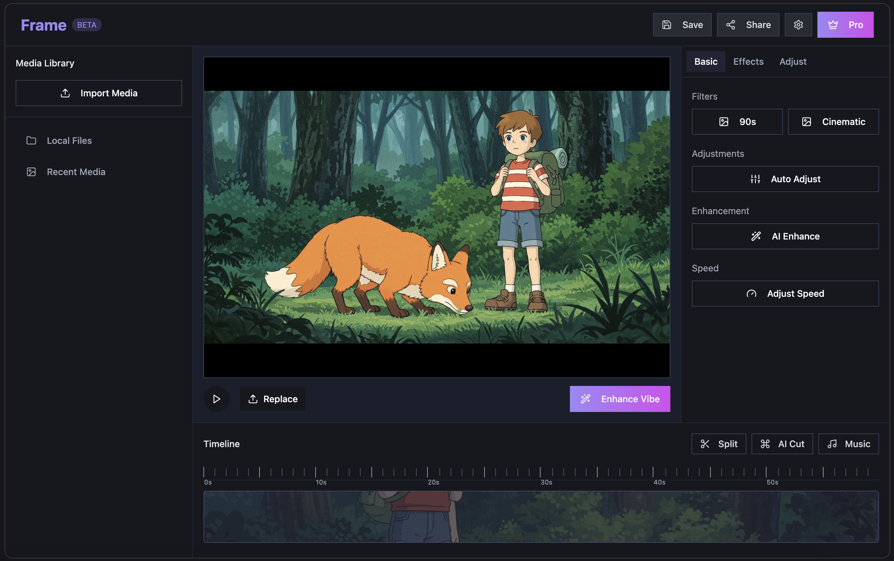

<h1 align="center">Frame: AI-Powered Video Editing with a Code-Like Creative Flow</h1>

**Frame** is an open-source alternative to Video Cut, reimagining video editing with AI power and a Cursor-level interactive experience. Designed for creators and developers, Frame automates repetitive tasks, enhances video quality, and provides a fluid, code-editor-like interface for effortless editing. Create stunning videos with ease, or extend Frame with your own features!

---

## 🌟 Features

- **Video Cut-Style Editing, Open-Source**: All the core features you love in Video Cut—timeline editing, transitions, effects—now fully open-source.
- **Cursor-Level Interaction**: Enjoy a smooth, intelligent UI with real-time previews, smart suggestions, and drag-and-drop simplicity, inspired by Cursor's code-editing fluidity.
- **AI-Powered Automation**: Auto-clip videos based on scene changes, audio peaks, or motion detection.
- **Video Enhancement**: AI-driven color correction, brightness adjustments, and style filters for professional-grade results.
- **Smart Organization**: Automatically tag and organize clips using AI (e.g., face detection, action recognition).
- **Extensible for Developers**: Add custom AI models, effects, or plugins to tailor Frame to your needs.
- **Cross-Platform**: Available on web, desktop, and (soon) mobile.

---

## Preview

